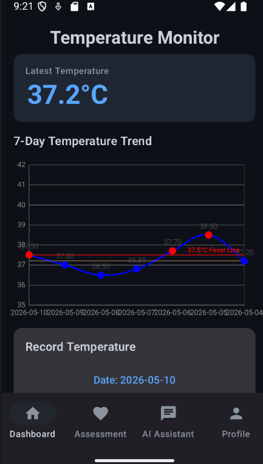
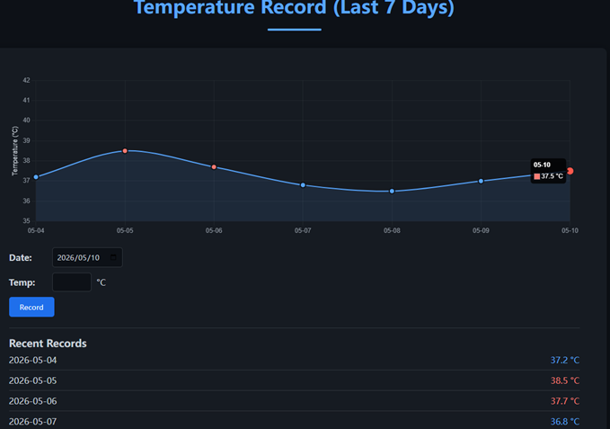

# Cold Prevention Guardian

Cold Prevention Guardian is my undergraduate project for cold and flu prevention support. The project has two versions: a native Android app and a web app. Both versions help users record body temperature, view recent trends, receive basic health guidance, check medication information, ask an AI health assistant, and interact with other users through comments.

The original idea was to build a simple tool around a common daily health signal: body temperature. Instead of only storing the number, the app turns it into a short trend, a risk level, and practical suggestions.

## Versions

| Version | Branch | Main files |
| --- | --- | --- |
| Android app | [`Android`](https://github.com/Phantom-0000/Cold-Prevention-Guardian-APP/tree/Android) | `Cold Prevention Guardian APP/` |
| Web app | [`Web`](https://github.com/Phantom-0000/Cold-Prevention-Guardian-APP/tree/Web) | `Cold Prevention Guardian.html`, `profile.html` |

The `main` branch is used as the repository landing page.

## Screenshots

| Android app | Web app |
| --- | --- |
|  |  |

## Features

- Login and registration with Firebase Authentication.
- User profile with language and age-group settings.
- Daily temperature recording with input validation.
- Temperature trend chart for recent records.
- Health assessment based on the latest temperature.
- Medication and prevention guidance with warning notes.
- AI health assistant using the latest temperature as context.
- Community comments with real-time updates and likes.
- Multilingual UI support for Chinese, English, German, French, and Spanish.

## Android App

The Android version is built with Kotlin and Jetpack Compose.

| Area | Technology |
| --- | --- |
| UI | Kotlin, Jetpack Compose, Material 3 |
| State | ViewModel, StateFlow |
| Navigation | Navigation Compose |
| Backend | Firebase Authentication, Firebase Realtime Database |
| AI assistant | DeepSeek API with Retrofit and OkHttp |
| Chart | MPAndroidChart inside Compose |
| Build | Gradle Kotlin DSL |

Basic structure:

```text
Cold Prevention Guardian APP/
  app/src/main/java/com/example/coldpreventionguardianapp/
    data/
      model/
      remote/
      repository/
    ui/
      auth/
      dashboard/
      details/
      chat/
      profile/
    viewmodel/
```

The app uses a simple MVVM-style structure. Compose screens read state from ViewModels, and repositories handle Firebase and API calls.

## Web App

The web version provides the same main workflow in two static pages.

| Area | Technology |
| --- | --- |
| UI | HTML, CSS, JavaScript |
| Authentication | Firebase Web SDK |
| Database | Firebase Realtime Database |
| Chart | Chart.js |
| AI assistant | DeepSeek API with `fetch` |

Files:

```text
Cold Prevention Guardian.html   Main page: temperature, chart, guidance, comments, AI assistant
profile.html                    Login, registration, profile, language, and age-group settings
```

The web app can be opened directly in a browser. It uses Firebase for account data and comments, and Chart.js for the temperature chart.

## Health Assessment Rules

The app uses the latest recorded temperature to choose a guidance level.

| Temperature | Level | Guidance |
| --- | --- | --- |
| `< 37.3 C` | Normal | Prevention and hygiene advice |
| `37.3 C - 37.9 C` | Mild elevation | Rest, hydration, and closer monitoring |
| `38.0 C - 38.9 C` | High fever / possible flu | Stronger warnings and doctor-consultation advice |
| `>= 39.0 C` | Emergency high fever | Urgent medical attention advice |

This project is for coursework and health education only. It does not provide medical diagnosis.

## Data Model

Firebase Realtime Database stores user data, temperature records, and comments.

```text
users/{uid}
  username
  email
  language
  ageGroup
  registeredAt
  temperatureRecords
    date
    temperature
    timestamp

comments/{commentId}
  author
  content
  date
  timestamp
  likes
  likedBy
```

## Run the Android App

```bash
git clone https://github.com/Phantom-0000/Cold-Prevention-Guardian-APP.git
cd Cold-Prevention-Guardian-APP
git checkout Android
cd "Cold Prevention Guardian APP"
```

Then open the project in Android Studio.

Firebase setup:

- Enable Email/Password Authentication.
- Enable Firebase Realtime Database.
- Add an Android app with package name `com.example.coldpreventionguardianapp`.
- Replace `app/google-services.json` if using a different Firebase project.

Build command:

```bash
./gradlew assembleDebug
```

On Windows:

```powershell
.\gradlew.bat assembleDebug
```

## Run the Web App

```bash
git clone https://github.com/Phantom-0000/Cold-Prevention-Guardian-APP.git
cd Cold-Prevention-Guardian-APP
git checkout Web
```

Open this file in a browser:

```text
Cold Prevention Guardian.html
```

## Security Notes

The current coursework version includes API configuration in client-side code. Before publishing or deploying it seriously:

- Move DeepSeek API keys out of Android source code and web JavaScript.
- Do not call private LLM APIs directly from browser JavaScript in production.
- Use a backend or serverless function to protect API keys.
- Rotate any key that has already been exposed.
- Review Firebase Realtime Database rules before making the app public.

## What I Practiced

- Building the same product idea for both Android and Web.
- Firebase Authentication and Realtime Database.
- Jetpack Compose UI and ViewModel-based state management.
- JavaScript DOM updates and Chart.js visualization.
- Connecting an AI chat API to user health context.
- Multilingual interface design.
- Writing user-facing guidance from simple health thresholds.

## Possible Improvements

- Add a short demo video.
- Add tests for the temperature assessment rules.
- Move shared health rules into a documented module or table.
- Improve offline and network error handling.
- Add wearable or Bluetooth thermometer support.
- Put the Web AI call behind a backend proxy.
